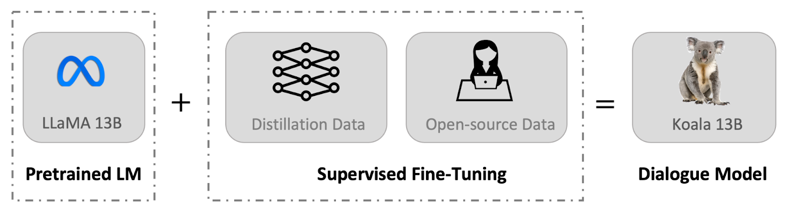
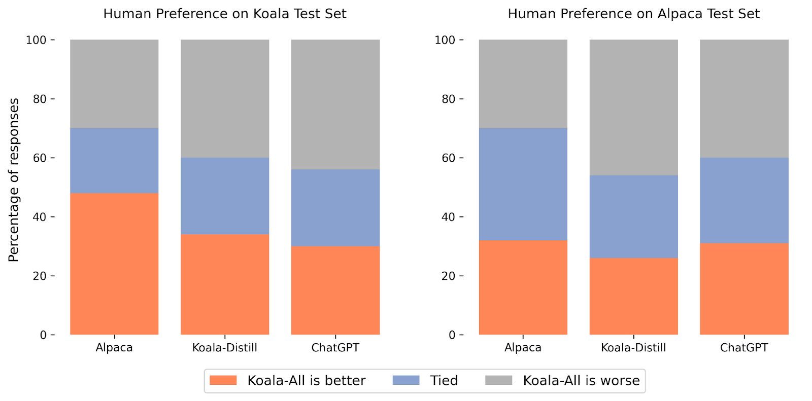
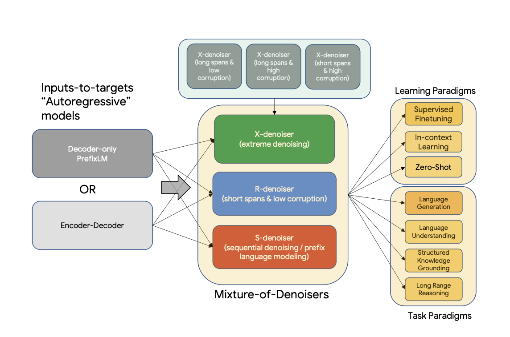
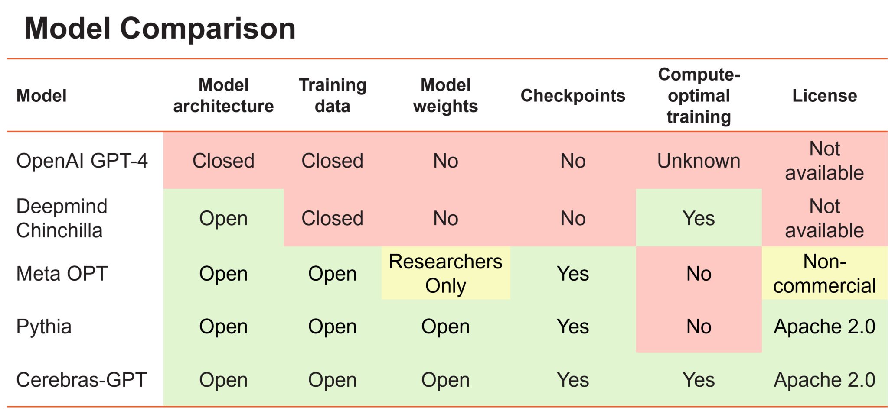
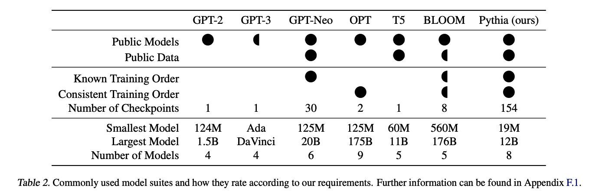
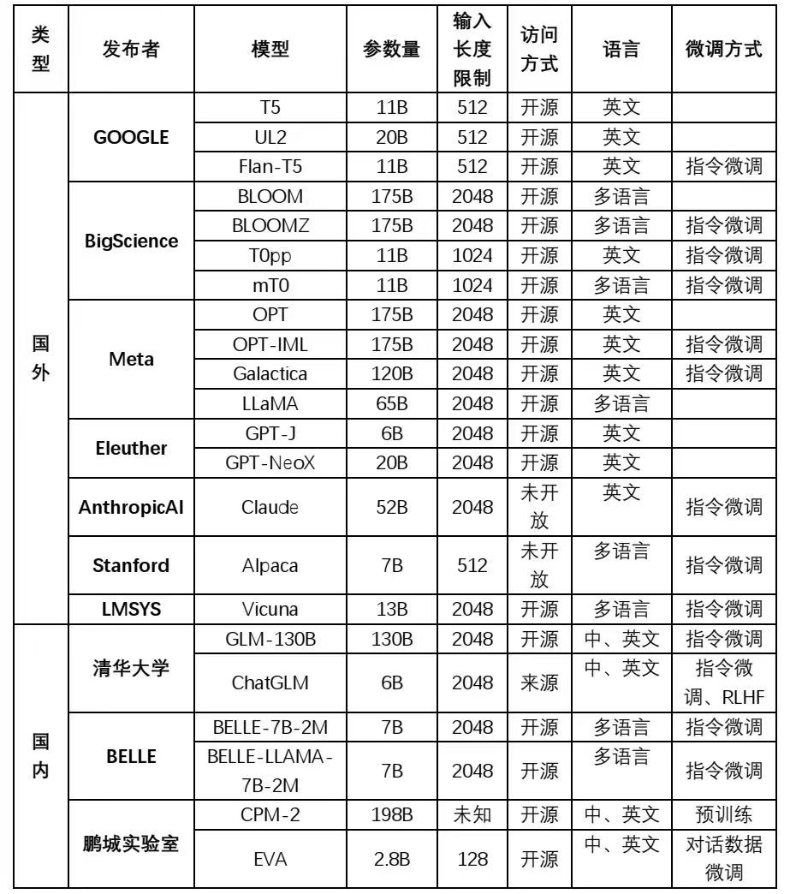

# Alpaca-family-library

Summarize all low-cost replication methods for Chatgpt countiously. It is believed that with the improvement of data and model fine-tuning techniques, small models suitable for various segmented fields will continue to emerge and have better performance.

Welcome everyone to provide pull requests, and I will also regularly track the latest developments in this repository！

**What's New！**

- Edit Structure 2023/4/25
- Add three new Motimodal models  2023/4/25
- Add Attachments 2023/4/25
- Initial construction 2022/3/27


## Catalogue

- [Chat with Open Large Language Model](#chat-with-open-large-language-model)
  - [Choose a model to chat with](#choose-a-model-to-chat-with)
- [What’s Alpaca](#whats-alpaca)
- [Models fine-tuned for application](#models-fine-tuned-for-application)
  - [Alpaca-LoRA: Low-Rank LLaMA Instruct-Tuning](#alpaca-lora-low-rank-llama-instruct-tuning)
  - [LLM-Adapters](#llm-adapters)
  - [Wombat 🐻‍❄️: from RLHF to RRHF, Aligning Human Preferences in a 'Right' Way](#wombat-️-from-rlhf-to-rrhf-aligning-human-preferences-in-a-right-way)
  - [Dolly](#dolly)
  - [Code Alpaca: An Instruction-following LLaMA Model trained on code generation instructions](#code-alpaca-an-instruction-following-llama-model-trained-on-code-generation-instructions)
  - [Evolving Alpaca: An Empirical Study on Instruction Tuning for Large Language Models (**Alpaca-CoT**)](#evolving-alpaca-an-empirical-study-on-instruction-tuning-for-large-language-models-alpaca-cot)
  - [ChatDoctor: A Medical Chat Model Fine-tuned on LLaMA Model using Medical Domain Knowledge](#chatdoctor-a-medical-chat-model-fine-tuned-on-llama-model-using-medical-domain-knowledge)
  - [Instruction Tuning with GPT-4](#instruction-tuning-with-gpt-4)
  - [DoctorGLM](#doctorglm)
  - [ChatGenTitle：使用百万arXiv论文信息在LLaMA模型上进行微调的论文题目生成模型](#chatgentitle使用百万arxiv论文信息在llama模型上进行微调的论文题目生成模型)
- [Models fine-tuned for different languages](#models-fine-tuned-for-different-languages)
  - [骆驼(Luotuo): Chinese-alpaca-lora](#骆驼luotuo-chinese-alpaca-lora)
  - [KoAlpaca: Korean Alpaca Model based on Stanford Alpaca](#koalpaca-korean-alpaca-model-based-on-stanford-alpaca)
  - [Chinese-Vicuna: A Chinese Instruction-following LLaMA-based Model —— 一个中文低资源的llama+lora方案](#chinese-vicuna-a-chinese-instruction-following-llama-based-model--一个中文低资源的llamalora方案)
  - [Chinese LLaMA \& Alpaca 大模型](#chinese-llama--alpaca-大模型)
  - [Japanese-Alpaca-LoRA](#japanese-alpaca-lora)
  - [Baize](#baize)
  - [Chinese-ChatLLaMA](#chinese-chatllama)
  - [Guanaco: A Multilingual Instruction-Following Language Model Based on LLaMA 7B](#guanaco-a-multilingual-instruction-following-language-model-based-on-llama-7b)
- [Models finetuned for Chat](#models-finetuned-for-chat)
  - [Koala: A Dialogue Model for Academic Research](#koala-a-dialogue-model-for-academic-research)
  - [FastChat](#fastchat)
  - [ChatGLM-6B](#chatglm-6b)
  - [BELLE: BE Large Language model Engine](#belle-be-large-language-model-engine)
  - [ChatYuan: Large Language Model for Dialogue in Chinese and English](#chatyuan-large-language-model-for-dialogue-in-chinese-and-english)
  - [Firefly(流萤): 中文对话式大语言模型](#firefly流萤-中文对话式大语言模型)
  - [GPT4All](#gpt4all)
  - [ChatRWKV](#chatrwkv)
  - [InstructGLM](#instructglm)
  - [ChatGLM-finetune-LoRA](#chatglm-finetune-lora)
- [Models fintuned for Multi-Modal Tasks](#models-fintuned-for-multi-modal-tasks)
  - [LLaVA: Large Language and Vision Assistant](#llava-large-language-and-vision-assistant)
  - [MiniGPT-4: Enhancing Vision-language Understanding with Advanced Large Language Models](#minigpt-4-enhancing-vision-language-understanding-with-advanced-large-language-models)
  - [VisualGPT](#visualgpt)
  - [Interactive ChatCaptioner for image and video](#interactive-chatcaptioner-for-image-and-video)
- [Some Large Language Models Projects](#some-large-language-models-projects)
  - [CodeGeeX: A Multilingual Code Generation Model](#codegeex-a-multilingual-code-generation-model)
  - [Llama-X: Open Academic Research on Improving LLaMA to SOTA LLM](#llama-x-open-academic-research-on-improving-llama-to-sota-llm)
- [Some Resources for Instruction Fine-tuning.](#some-resources-for-instruction-fine-tuning)
  - [🗂️ LlamaIndex 🦙 (GPT Index)](#️-llamaindex--gpt-index)
  - [LMFlow](#lmflow)
  - [Colossal-AI](#colossal-ai)
  - [alpaca\_chinese\_dataset](#alpaca_chinese_dataset)
- [Attachment](#attachment)
- [Contributors](#contributors)


## Chat with Open Large Language Model

In this website, you can try out many language models mentioned in this repository to conveniently compare their performance and choose the most suitable model for you!

Web:  https://chat.lmsys.org/

- Vicuna: An Open-Source Chatbot Impressing GPT-4 with 90% ChatGPT Quality. [[Blog post\]](https://vicuna.lmsys.org/) [[GitHub\]](https://github.com/lm-sys/FastChat)
- Koala: A Dialogue Model for Academic Research. [[Blog post\]](https://bair.berkeley.edu/blog/2023/04/03/koala/) [[GitHub\]](https://github.com/young-geng/EasyLM)
- This demo server. [[GitHub\]](https://github.com/lm-sys/FastChat)

### Choose a model to chat with

- [Vicuna](https://vicuna.lmsys.org/): a chat assistant fine-tuned from LLaMA on user-shared conversations. This one is expected to perform best according to our evaluation.
- [Koala](https://bair.berkeley.edu/blog/2023/04/03/koala/): a chatbot fine-tuned from LLaMA on user-shared conversations and open-source datasets. This one performs similarly to Vicuna.
- [ChatGLM](https://chatglm.cn/blog): An Open Bilingual Dialogue Language Model | 开源双语对话语言模型
- [Alpaca](https://crfm.stanford.edu/2023/03/13/alpaca.html): a model fine-tuned from LLaMA on 52K instruction-following demonstrations.
- [LLaMA](https://arxiv.org/abs/2302.13971): open and efficient foundation language models


## What’s Alpaca

Contains:  `Dataset`,`Data Genrating Code`, `Finetune Code`, `Web Demo`, `Benchmark`

Alpaca project aims to build and share an instruction-following LLaMA model. 

- Github Page: https://github.com/tatsu-lab/stanford_alpaca
- Blog Post: https://crfm.stanford.edu/2023/03/13/alpaca.html
- Web Demo: https://crfm.stanford.edu/alpaca/

The repo contains:

- The [52K data](https://github.com/tatsu-lab/stanford_alpaca#data-release) used for fine-tuning the model.
- The code for [generating the data](https://github.com/tatsu-lab/stanford_alpaca#data-generation-process).
- The code for [fine-tuning the model](https://github.com/tatsu-lab/stanford_alpaca#fine-tuning).


The current Alpaca model is fine-tuned from a 7B LLaMA model [1] on 52K instruction-following data generated by the techniques in the Self-Instruct [2] paper, with some modifications that we discuss in the next section. In a preliminary human evaluation, we found that the Alpaca 7B model behaves similarly to the `text-davinci-003` model on the Self-Instruct instruction-following evaluation suite [2].

[1]: LLaMA: Open and Efficient Foundation Language Models. Hugo Touvron, Thibaut Lavril, Gautier Izacard, Xavier Martinet, Marie-Anne Lachaux, Timothée Lacroix, Baptiste Rozière, Naman Goyal, Eric Hambro, Faisal Azhar, Aurelien Rodriguez, Armand Joulin, Edouard Grave, Guillaume Lample. https://arxiv.org/abs/2302.13971v1

[2]: Self-Instruct: Aligning Language Model with Self Generated Instructions. Yizhong Wang, Yeganeh Kordi, Swaroop Mishra, Alisa Liu, Noah A. Smith, Daniel Khashabi, Hannaneh Hajishirzi. https://arxiv.org/abs/2212.10560

Some applications:

- Cleaned Alpaca Dataset：https://github.com/gururise/AlpacaDataCleaned

  - This repository hosts a cleaned and curated version of a dataset used to train the Alpaca LLM (Large Language Model). The original dataset had several issues that are addressed in this cleaned version.

- Serge - LLaMa made easy 🦙: https://github.com/nsarrazin/serge

  - A chat interface based on `llama.cpp` for running Alpaca models. Entirely self-hosted, no API keys needed. Fits on 4GB of RAM and runs on the CPU.

- Run LLaMA (and Stanford-Alpaca) inference on Apple Silicon GPUs: https://github.com/jankais3r/LLaMA_MPS

- Alpaca Chinese Finetune Dataset: https://github.com/carbonz0/alpaca-chinese-dataset

- 🐫 self-hosted, Simple LLaMA/*alpaca* API & CLI written in go: [go-skynet/llama-cli](https://github.com/go-skynet/llama-cli)

  

## Models fine-tuned for application

A series of fine-tuned models derived from the Alpaca model. Some of them have publicly available weights, are fine-tuned for specific domains, and have better performance. These types of models are still being continuously developed.


### Alpaca-LoRA: Low-Rank LLaMA Instruct-Tuning

Contains:  `Dataset`, `Data Genrating Code`, `Finetune Code`, `Model Weight`, `LoRA`

- Github Page: https://github.com/tloen/alpaca-lora
- Discord Community: [here](https://discord.gg/prbq284xX5)
- Model: **[here](https://huggingface.co/spaces/tloen/alpaca-lora)**

This repository contains code for reproducing the [Stanford Alpaca](https://github.com/tatsu-lab/stanford_alpaca) results using [low-rank adaptation (LoRA)](https://arxiv.org/pdf/2106.09685.pdf). Alpaca-LoRA provide an Instruct model of similar quality to `text-davinci-003` that can run [on a Raspberry Pi](https://twitter.com/miolini/status/1634982361757790209) (for research), and the code is easily extended to the `13b`, `30b`, and `65b` models.

In addition to the training code, which runs within five hours on a single RTX 4090, Alpaca-LoRA publish a script for downloading and inference on the foundation model and LoRA, as well as the resulting [LoRA weights themselves](https://huggingface.co/tloen/alpaca-lora-7b/tree/main). To fine-tune cheaply and efficiently, Alpaca-LoRA use Hugging Face's [PEFT](https://github.com/huggingface/peft) as well as Tim Dettmers' [bitsandbytes](https://github.com/TimDettmers/bitsandbytes).

Without hyperparameter tuning, the LoRA model produces outputs comparable to the Stanford Alpaca model. 

Some applications:

- Alpaca-LoRA as a Chatbot Service: https://github.com/deep-diver/Alpaca-LoRA-Serve


### LLM-Adapters

Contains:  `Dataset`, `Finetune Code`

- Github Page: https://github.com/tloen/alpaca-lora 
- DataSet and Benchmark: https://github.com/AGI-Edgerunners/LLM-Adapters/tree/main/dataset
- Paper:  https://arxiv.org/abs/2304.01933

*LLM-Adapters: An Adapter Family for Parameter-Efficient Fine-Tuning of Large Language Models*

LLM-Adapters is an easy-to-use framework that integrates various adapters into LLMs and can execute adapter-based PEFT methods of LLMs for different tasks. LLM-Adapter is an extension of HuggingFace's PEFT library, many thanks for their amazing work! Please find our paper at this link: https://arxiv.org/abs/2304.01933.

The framework includes state-of-the-art open-access LLMs: LLaMa, OPT, BLOOM, and GPT-J, as well as widely used adapters such as Bottleneck adapters, Parallel adapters, and LoRA.


### Wombat 🐻‍❄️: from RLHF to RRHF, Aligning Human Preferences in a 'Right' Way

Contains:   `Model Weight`, `Data Genrating Code`,`Dataset`, `Finetune Code`,  `Web Demo`

[](https://en.wikipedia.org/wiki/Wombat)

Wombats are adorable little creatures native to Australia. The first three pictures are generated from Stable Diffusion.

This is the repository for RRHF (**R**ank **R**esponse to align **H**uman **F**eedback) and open-sourced language models Wombat. RRHF helps align large language models with human perference easier.

- Github Page:https://github.com/GanjinZero/RRHF
- Model: https://huggingface.co/GanjinZero/wombat-7b-delta
- Paper: https://github.com/GanjinZero/RRHF/blob/main/assets/rrhf.pdf

Reinforcement Learning from Human Feedback (RLHF) enables the alignment of large language models with human preference, improving the quality of interactions between humans and language models. Recent practice of RLHF uses PPO to enable the large language model optimization of such alignment. However, implementing PPO is non-trivial (where the training procedure requires interactive between policy, behavior policy, reward, value model) and it is also tedious to tuning many hyper-parameters. Our motivation is to simplify the alignment between language models with human preference, and our proposed paradigm RRHF (**R**ank **R**esponse from **H**uman **F**eedback) can achieve such alignment as easily as conventional fine-tuning. It is simpler than PPO from the aspects of coding, model counts, and hyperparameters.


### Dolly

Contains: `Dataset`, `Model Weight`, `Finetune Code`, `Manual Annotation`

- Github Page: https://github.com/databrickslabs/dolly/tree/master
- Model: https://huggingface.co/databricks/dolly-v2-12b
- Dataset: https://github.com/databrickslabs/dolly/tree/master/data

Databricks’ [Dolly](https://huggingface.co/databricks/dolly-v2-12b) is an instruction-following large language model trained on the Databricks machine learning platform that is licensed for commercial use. Based on `pythia-12b`, Dolly is trained on ~15k instruction/response fine tuning records [`databricks-dolly-15k`](https://github.com/databrickslabs/dolly/tree/master/data) generated by Databricks employees in capability domains from the InstructGPT paper, including brainstorming, classification, closed QA, generation, information extraction, open QA and summarization. `dolly-v2-12b` is not a state-of-the-art model, but does exhibit surprisingly high quality instruction following behavior not characteristic of the foundation model on which it is based.

```
+-----------------------------------+--------------+------------+--------------+-------------+-----------------+----------+----------+----------+
|  model                            |   openbookqa |   arc_easy |   winogrande |   hellaswag |   arc_challenge |     piqa |    boolq |    gmean |
+-----------------------------------+--------------+------------+--------------+-------------+-----------------+----------+----------+----------|
| EleutherAI/pythia-2.8b            |        0.348 |   0.585859 |     0.589582 |    0.591217 |        0.323379 | 0.73395  | 0.638226 | 0.523431 |
| EleutherAI/pythia-6.9b            |        0.368 |   0.604798 |     0.608524 |    0.631548 |        0.343857 | 0.761153 | 0.6263   | 0.543567 |
| databricks/dolly-v2-2-8b          |        0.384 |   0.611532 |     0.589582 |    0.650767 |        0.370307 | 0.742655 | 0.575535 | 0.544886 |
| EleutherAI/pythia-12b             |        0.364 |   0.627104 |     0.636148 |    0.668094 |        0.346416 | 0.760065 | 0.673394 | 0.559676 |
| EleutherAI/gpt-j-6B               |        0.382 |   0.621633 |     0.651144 |    0.662617 |        0.363481 | 0.761153 | 0.655963 | 0.565936 |
| databricks/dolly-v2-12b           |        0.408 |   0.63931  |     0.616417 |    0.707927 |        0.388225 | 0.757889 | 0.568196 | 0.56781  |
| databricks/dolly-v2-6-9b          |        0.392 |   0.633838 |     0.607735 |    0.686517 |        0.406997 | 0.750816 | 0.644037 | 0.573487 |
| databricks/dolly-v1-6b            |        0.41  |   0.62963  |     0.643252 |    0.676758 |        0.384812 | 0.773667 | 0.687768 | 0.583431 |
| EleutherAI/gpt-neox-20b           |        0.402 |   0.683923 |     0.656669 |    0.7142   |        0.408703 | 0.784004 | 0.695413 | 0.602236 |
+-----------------------------------+--------------+------------+--------------+-------------+-----------------+----------+----------+----------+

```


### Code Alpaca: An Instruction-following LLaMA Model trained on code generation instructions

Contains: `Dataset`, `Data Genrating Code`, `Finetune Code`, `Web Demo`

This is the repo for the Code Alpaca project, which aims to build and share an instruction-following LLaMA model for code generation. This repo is fully based on [Stanford Alpaca](https://github.com/tatsu-lab/stanford_alpaca) ,and only changes the data used for training. Training approach is the same.

- Github Page: https://github.com/sahil280114/codealpaca
- Web Demo: https://code-alpaca-demo.vercel.app/


### Evolving Alpaca: An Empirical Study on Instruction Tuning for Large Language Models (**Alpaca-CoT**)

Contains: `Dataset`, `Data Genrating Code`, `Finetune Code`, `LoRA`

This is the repository for the `Evolving Alpaca` project, which aims to extensively collect instruction-tuning datasets (especially the CoT datasets) and conduct an in-depth empirical study based on [LLaMA](https://arxiv.org/abs/2302.13971v1) model. `Evolving` is used to describe the continuous expansion of our instruction-tuning data collection, which will continuously enhance [Alpaca](https://github.com/tatsu-lab/stanford_alpaca)'s instruction-following capabilities.

- Github Page: https://github.com/PhoebusSi/Alpaca-CoT
- Web Demo: https://code-alpaca-demo.vercel.app/


### [ChatDoctor: A Medical Chat Model Fine-tuned on LLaMA Model using Medical Domain Knowledge](https://arxiv.org/abs/2303.14070)

Contains:  `Dataset`,  `Finetune Code`, `Model Weight`,  `Web Demo`

This work collected more than 700 diseases and their corresponding symptoms, recommended medications, and required medical tests, and then generated 5K doctor-patient conversations. By fine-tuning models of doctor-patient conversations, these models emerge with great potential to understand patients' needs, provide informed advice, and offer valuable assistance in a variety of medical-related fields. The integration of these advanced language models into healthcare can revolutionize the way healthcare professionals and patients communicate, ultimately improving the overall quality of care and patient outcomes.

- Github Page: https://github.com/Kent0n-Li/ChatDoctor
- Model: [link](https://forms.office.com/Pages/ResponsePage.aspx?id=lYZBnaxxMUy1ssGWyOw8ij06Cb8qnDJKvu2bVpV1-ANUMDIzWlU0QTUxN0YySFROQk9HMVU0N0xJNC4u)
- Dataset: https://github.com/Kent0n-Li/ChatDoctor#data-and-model
- WebDemo: https://huggingface.co/spaces/kenton-li/ChatDoctor
- Arixv: https://arxiv.org/abs/2303.14070


### Instruction Tuning with GPT-4

Contains:  `Dataset`,  `Finetune Code`

- Github Page: https://github.com/Instruction-Tuning-with-GPT-4/GPT-4-LLM
- Arxiv: https://arxiv.org/abs/2304.03277

This is the repo for the GPT-4-LLM, which aims to share data generated by GPT-4 for building an instruction-following LLMs with supervised learning and reinforcement learning. The repo contains:

- English Instruction-Following [Data](https://github.com/Instruction-Tuning-with-GPT-4/GPT-4-LLM#data-release) generated by GPT-4 using Alpaca prompts for fine-tuning LLMs.
- Chinese Instruction-Following [Data](https://github.com/Instruction-Tuning-with-GPT-4/GPT-4-LLM#data-release) generated by GPT-4 using Chinese prompts translated from Alpaca by ChatGPT.
- Comparison [Data](https://github.com/Instruction-Tuning-with-GPT-4/GPT-4-LLM#data-release) ranked by GPT-4 to train reward models.
- Answers on Unnatural Instructions [Data](https://github.com/Instruction-Tuning-with-GPT-4/GPT-4-LLM#data-release) from GPT-4 to quantify the gap between GPT-4 and instruction-tuned models at scale.


### DoctorGLM

Contains:  `Dataset`,  `Finetune Code`,  `LoRA`,  `Model Weight`

中文问诊模型， 基于 ChatGLM-6B + lora 进行finetune

finetune代码来自 https://github.com/ssbuild/chatglm_finetuning

- Github Page: https://github.com/xionghonglin/DoctorGLM
- Model: https://github.com/xionghonglin/DoctorGLM/tree/main/Doctor_GLM
- DataSet: https://github.com/Toyhom/Chinese-medical-dialogue-data


### ChatGenTitle：使用百万arXiv论文信息在LLaMA模型上进行微调的论文题目生成模型

Contains:  `Dataset`,  `LoRA`,  `Model Weight`

- Github Page: https://github.com/WangRongsheng/ChatGenTitle

- Model: https://github.com/WangRongsheng/ChatGenTitle#release

  

通过 arXiv 上开放的论文信息，我们构建了一个包含 220 万篇论文元信息的数据库。这些数据通过数据清洗等被构建成了可以用于大模型微调的数据对。将这些论文元信息引入大模型微调，它可以对生成论文题目涉及的难点产生积极影响，它可以从以下几个方面提供帮助： 

\1. 提供更准确、广泛的语言模型：大模型通常使用了大量数据进行训练，因此其语言模型可以更准确地解释自然语言，能够应对更多的语言场景，提升论文题目的语言表达能力；

\2. 提供更加精准的语义理解：大模型采用了深度学习的技术手段，能够构建语言的高维向量表示，从而提供更准确的语义理解能力，帮助生成更精确、准确的论文题目；

\3. 增强创造性和创新性：大模型使用了大量的训练数据，并能够从数据中提取规律，从而提供更多的词汇或句子组合方式，增强了生成论文题目的创造性和创新性；

\4. 提高效率：相比传统的手动方式，使用大模型来生成论文题目可以极大地提高效率，不仅减少了需要写出标题的时间，同时也不容易产生显著的错误，提高了输出的质量。 


## Models fine-tuned for different languages

### 骆驼(Luotuo): Chinese-alpaca-lora

Contains: `Data Genrating Code`,  `Model Weight`, `LoRA`, `Benchmark`

A Chinese finetuned instruction LLaMA. 

- Github Page: https://github.com/LC1332/Chinese-alpaca-lora
- Model: https://huggingface.co/silk-road/luotuo-lora-7b-0.3


### KoAlpaca: Korean Alpaca Model based on Stanford Alpaca

Contains:  `Dataset`, `Data Genrating Code`, `Finetune Code`, `Model Weight`, `LoRA`, `Benchmark`

The Korean Alpaca model is learned in the same way as the Stanford Alpaca model.

Benchmark

- Github Page: https://github.com/Beomi/KoAlpaca

- Telegram app: http://pf.kakao.com/_wdRxcxj

- Model: https://huggingface.co/beomi/KoAlpaca-65B-LoRA

  

### Chinese-Vicuna: A Chinese Instruction-following LLaMA-based Model —— 一个中文低资源的llama+lora方案

Contains:  `Dataset`, `Data Genrating Code`, `Finetune Code`, `Model Weight`, `LoRA`, `Benchmark`

This is the repo for the Chinese-Vicuna project, which aims to build and share an instruction-following Chinese LLaMA model which can run on a single Nvidia RTX-2080TI, that why we named this project `Vicuna`, small but strong enough !

- Github Page: https://github.com/Facico/Chinese-Vicuna
- Model:  https://github.com/Facico/Chinese-Vicuna/tree/master/lora-Vicuna/checkpoint-final


### Chinese LLaMA & Alpaca 大模型

Contains:  `Model Weight`, `LoRA`,

To promote open research of large models in the Chinese NLP community, this project has open-sourced the **Chinese LLaMA model and the Alpaca large model with instruction fine-tuning**. These models expand the Chinese vocabulary based on the original LLaMA and use Chinese data for secondary pre-training, further enhancing Chinese basic semantic understanding. Additionally, the project uses Chinese instruction data for fine-tuning on the basis of the Chinese LLaMA, significantly improving the model's understanding and execution of instructions.

- Github Page:https://github.com/ymcui/Chinese-LLaMA-Alpaca

Note: The following models cannot be used directly and must be reconstructed following the steps provided in this project's [Model Reconstruction](https://github.com/ymcui/Chinese-LLaMA-Alpaca/blob/main/README_EN.md#Model-Reconstruction) section.

| Model Name        | Type                        | Base Model Required for Reconstruction | Size[2] | LoRA Download Link                                                                                | SHA256[3]          |
| ----------------- | --------------------------- | -------------------------------------- | ------- | ------------------------------------------------------------------------------------------------- | ------------------ |
| Chinese-LLaMA-7B  | General                     | Original LLaMA-7B[1]                   | 770M    | [[Cloud Disk Link\]](https://pan.baidu.com/s/1oORTdpr2TvlkxjpyWtb5Sw?pwd=33hb) （Password: 33hb） | 39b86b......fe0e60 |
| Chinese-Alpaca-7B | Fine-tuned for Instructions | Original LLaMA-7B[1]                   | 790M    | [[Cloud Disk Link\]](https://pan.baidu.com/s/1xV1UXjh1EPrPtXg6WyG7XQ?pwd=923e) （Password：923e） | 9bb5b6......ce2d87 |


### Japanese-Alpaca-LoRA

Contains:  `Dataset`,  `Finetune Code`,  `LoRA`, 

A Japanese finetuned instruction LLaMA.

- Github Page: https://github.com/masa3141/japanese-alpaca-lora


### Baize

Contains:  `Dataset`,  `Finetune Code`,  `LoRA`, `Model Weight`,`Web Demo`

Baize is an open-source chat model fine-tuned with [LoRA](https://github.com/microsoft/LoRA). It uses 100k dialogs generated by letting ChatGPT chat with itself. We also use Alpaca's data to improve its performance. We have released 7B, 13B and 30B models. 60B model coming soon. Please refer to the [paper](https://arxiv.org/pdf/2304.01196.pdf) for more details.

- Github Page: https://github.com/project-baize/baize/tree/main
- Model:  https://huggingface.co/project-baize
- Web Demo: https://huggingface.co/spaces/project-baize/baize-lora-7B
- Dataset: https://github.com/project-baize/baize/blob/main/data
- Paper: https://arxiv.org/abs/2304.01196


### Chinese-ChatLLaMA

Contains:  `Dataset`,  `Finetune Code`,  `Model Weight`

- Github Page: https://github.com/ydli-ai/Chinese-ChatLLaMA
- Model:  https://huggingface.co/P01son/ChatLLaMA-zh-7B
- Dataset: https://github.com/dbiir/UER-py/wiki/%E9%A2%84%E8%AE%AD%E7%BB%83%E6%95%B0%E6%8D%AE

本项目向社区提供中文对话模型 ChatLLama 、中文基础模型 LLaMA-zh 及其训练数据。 模型基于 [TencentPretrain](https://github.com/Tencent/TencentPretrain) 多模态预训练框架构建， 项目也将陆续开放 7B、13B、30B、65B 规模的中文基础模型 LLaMA-zh 权重。

ChatLLaMA 支持简繁体中文、英文、日文等多语言。 LLaMA 在预训练阶段主要使用英文，为了将其语言能力迁移到中文上，首先进行中文增量预训练， 使用的语料包括中英翻译、中文维基/百度百科、社区互动问答、科学文献等。再通过指令微调得到 ChatLLaMA。


### Guanaco: A Multilingual Instruction-Following Language Model Based on LLaMA 7B

Contains:   `Model Weight`, `Dataset`, `Lora`

Guanaco is an instruction-following language model trained on Meta's LLaMA 7B model. Building upon the original 52K data from the Alpaca model, we added an additional 534,530 entries, covering English, Simplified Chinese, Traditional Chinese (Taiwan), Traditional Chinese (Hong Kong), Japanese, Deutsch and various linguistic and grammatical tasks. By retraining and optimizing the model with this rich data, Guanaco demonstrates excellent performance and potential in a multilingual environment.

To promote openness and replicability in research, we have made the [Guanaco Dataset](https://huggingface.co/datasets/JosephusCheung/GuanacoDataset) publicly available and plan to release the model weights in the future. By providing these resources, we hope to encourage more researchers to engage in related research and jointly advance the development of instruction-following language models.

When using the Guanaco model, please note the following points:
\- The Guanaco model has not yet been filtered for harmful, biased, or explicit content. During use, outputs that do not conform to ethical norms may be generated. Please pay special attention to this issue in research or practical applications.

- Github Page: https://guanaco-model.github.io/
- Dataset: https://huggingface.co/datasets/JosephusCheung/GuanacoDataset
- Model:
  - Base Model: https://huggingface.co/KBlueLeaf/guanaco-7B-leh
  - Lora:  https://huggingface.co/JosephusCheung/GuanacoLatest


##  Models finetuned for Chat

This type of model is mainly fine-tuned for dialogue tasks, so it has good conversation response capabilities.

### Koala: A Dialogue Model for Academic Research

Contains: `Dataset`, `Evalutaion`, `Finetune Code`, `Web Demo`

- Blog: https://bair.berkeley.edu/blog/2023/04/03/koala/
- Model: https://huggingface.co/young-geng/koala/tree/main



Koala, a chatbot trained by fine-tuning Meta’s [LLaMA](https://ai.facebook.com/blog/large-language-model-llama-meta-ai/) on dialogue data gathered from the web. We describe the dataset curation and training process of our model, and also present the results of a user study that compares our model to [ChatGPT](https://openai.com/blog/chatgpt) and [Stanford’s Alpaca](https://crfm.stanford.edu/2023/03/13/alpaca.html). Our results show that Koala can effectively respond to a variety of user queries, generating responses that are often preferred over Alpaca, and at least tied with ChatGPT in over half of the cases.



- [An online interactive demo of Koala](https://koala.lmsys.org/)
- [EasyLM: our open source framework we used to train Koala](https://github.com/young-geng/EasyLM)
- [The code for preprocessing our training data](https://github.com/young-geng/koala_data_pipeline)
- [Our test set of queries](https://github.com/arnav-gudibande/koala-test-set)
- [Koala model weights diff against the base LLaMA model](https://huggingface.co/young-geng/koala/tree/main)


### FastChat

Contains:   `Dataset`, `Finetune Code`,  `Web Demo`

- Github Page: https://github.com/lm-sys/FastChat
- Blog: https://vicuna.lmsys.org/
- Dataset: https://github.com/lm-sys/FastChat/blob/main/playground/data/alpaca-data-conversation.json
- WebDemo: https://chat.lmsys.org/

Vicuna-13B, an open-source chatbot trained by fine-tuning LLaMA on user-shared conversations collected from ShareGPT. Preliminary evaluation using GPT-4 as a judge shows Vicuna-13B achieves more than 90%* quality of OpenAI ChatGPT and Google Bard while outperforming other models like LLaMA and Stanford Alpaca in more than 90%* of cases. The cost of training Vicuna-13B is around $300. The training and serving [code](https://github.com/lm-sys/FastChat), along with an online [demo](https://chat.lmsys.org/), are publicly available for non-commercial use.


### ChatGLM-6B

Contains:   `Model Weight`, `Web Demo`

- Github Page: https://github.com/THUDM/ChatGLM-6B
- Blog: https://chatglm.cn/blog
- Model: [Hugging Face Hub](https://huggingface.co/THUDM/chatglm-6b)

ChatGLM-6B is an open-source, bilingual (Chinese and English) conversational language model based on the General Language Model (GLM) architecture with 6.2 billion parameters. With model quantization technology, users can deploy it locally on consumer-grade graphics cards (with a minimum of only 6GB VRAM at INT4 quantization level). ChatGLM-6B uses similar techniques to ChatGPT and has been optimized for Chinese question answering and dialogue. After training on approximately 1 trillion identifiers in both Chinese and English, combined with supervised fine-tuning, feedback self-help, human feedback reinforcement learning technologies, the 62 billion parameter ChatGLM-6B can generate responses that are quite consistent with human preferences.

Some applications:

- A cost-effective implementation plan for ChatGPT, based on Tsinghua's ChatGLM-6B + LoRA for finetuning: https://github.com/mymusise/ChatGLM-Tuning
- *Chatglm* 6b finetuning and alpaca finetuning: https://github.com/ssbuild/chatglm_finetuning
- A webui for ChatGLM made by THUDM.https://github.com/Akegarasu/ChatGLM-webui
- 图文生成版 Visual OpenLLM：https://github.com/visual-openllm/visual-openllm


### OpenChatKit

Contains:   `Model Weight`,  `Dataset`, `Finetune Code`, `Web Demo`

- Github Page: https://github.com/togethercomputer/OpenChatKit
- Model: https://github.com/togethercomputer/OpenChatKit/blob/main/docs/GPT-NeoXT-Chat-Base-20B.md
- Web Demo：https://huggingface.co/spaces/togethercomputer/OpenChatKit

OpenChatKit provides a powerful, open-source base to create both specialized and general purpose chatbots for various applications. The kit includes an instruction-tuned language models, a moderation model, and an extensible retrieval system for including up-to-date responses from custom repositories. OpenChatKit models were trained on the OIG-43M training dataset, which was a collaboration between [Together](https://www.together.xyz/), [LAION](https://laion.ai/), and [Ontocord.ai](https://ontocord.ai/).

In this repo, you'll find code for:

- Training GPT-NeoXT-Chat-Base-20B, a 20B parameter chat model (see [docs/GPT-NeoXT-Chat-Base-20B.md](https://github.com/togethercomputer/OpenChatKit/blob/main/docs/GPT-NeoXT-Chat-Base-20B.md))
- Training Pythia-Chat-Base-7B, a 7B parameter chat model
- Testing inference using either of the chat models
- Augmenting the model with additional context from a retrieval index


### Open Assistant

Contains:   `Model Weight`,  `Dataset`,  `Web Demo`

- Page: https://open-assistant.io/
- Github: https://github.com/LAION-AI/Open-Assistant
- Huggingface & dataset: https://huggingface.co/OpenAssistant

Open Assistant is a project meant to give everyone access to a great chat based large language model.

We believe that by doing this we will create a revolution in innovation in language. In the same way that stable-diffusion helped the world make art and images in new ways we hope Open Assistant can help improve the world by improving language itself.


### BELLE: BE Large Language model Engine

Contains:   `Model Weight`, `Data Genrating Code`,`Dataset`

- Github Page: https://github.com/LianjiaTech/BELLE
- Model: https://huggingface.co/BelleGroup
- Zhihu: https://zhuanlan.zhihu.com/p/616079388

The goal of this project is to promote the development of the open-source community for Chinese language large-scale conversational models. This project optimizes Chinese performance in addition to original Alpaca. The model finetuning uses only data generated via ChatGPT (without other data).

- Data Release: The Chinese dataset generated [1M](https://huggingface.co/datasets/BelleGroup/generated_train_1M_CN) + [0.5M](https://huggingface.co/datasets/BelleGroup/generated_train_0.5M_CN), using [Stanford Alpaca](https://github.com/tatsu-lab/stanford_alpaca) as reference
- The model optimized based on BLOOMZ-7B1-mt: [BELLE-7B-0.2M](https://huggingface.co/BelleGroup/BELLE-7B-0.2M)，[BELLE-7B-0.6M](https://huggingface.co/BelleGroup/BELLE-7B-0.6M)，[BELLE-7B-1M](https://huggingface.co/BelleGroup/BELLE-7B-1M)，[BELLE-7B-2M](https://huggingface.co/BelleGroup/BELLE-7B-2M)
- The model optimized based on LLAMA: [BELLE-LLAMA-7B-0.6M](https://huggingface.co/BelleGroup/BELLE-LLAMA-7B-0.6M)，[BELLE-LLAMA-7B-2M](https://huggingface.co/BelleGroup/BELLE-LLAMA-7B-2M)


### ChatYuan: Large Language Model for Dialogue in Chinese and English

Contains:   `Model Weight`, `Pretrain Code`,`Finetune Code`, `Web Demo`

- Github Page: https://github.com/clue-ai/ChatYuan
- Model: https://huggingface.co/ClueAI/ChatYuan-large-v2, https://modelscope.cn/models/ClueAI/ChatYuan-large-v2/summary
- Web Demo: https://huggingface.co/spaces/ClueAI/ChatYuan-large-v2
- Discord: https://discord.gg/hUVyMRByaE

ChatYuan-large-v2是一个支持中英双语的功能型对话语言大模型。ChatYuan-large-v2使用了和 v1版本相同的技术方案，在微调数据、人类反馈强化学习、思维链等方面进行了优化。

ChatYuan large v2 is an open-source large language model for dialogue, supports both Chinese and English languages, and in ChatGPT style.

ChatYuan-large-v2是ChatYuan系列中以轻量化实现高质量效果的模型之一，用户可以在消费级显卡、 PC甚至手机上进行推理（INT4 最低只需 400M ）。


### Firefly(流萤): 中文对话式大语言模型

Contains:   `Model Weight`, `Dataset`, `Finetune Code`, 

- Github Page: https://github.com/yangjianxin1/Firefly
- Model: https://huggingface.co/YeungNLP/firefly-2b6
- Dataset: https://huggingface.co/datasets/YeungNLP/firefly-train-1.1M

**Firefly（流萤）** 是一个开源的中文对话式大语言模型，使用指令微调（Instruction Tuning）在中文数据集上进行调优。同时使用了词表裁剪、ZeRO、张量并行等技术，有效降低显存消耗和提高训练效率。 在训练中，我们使用了更小的模型参数量，以及更少的计算资源。

我们构造了许多与中华文化相关的数据，以提升模型这方面的表现，如对联、作诗、文言文翻译、散文、金庸小说等。

- **数据集**：[firefly-train-1.1M](https://huggingface.co/datasets/YeungNLP/firefly-train-1.1M) ， 一份高质量的包含1.1M中文多任务指令微调数据集，包含23种常见的中文NLP任务的指令数据。对于每个任务，由人工书写若干指令模板，保证数据的高质量与丰富度。
- **模型裁剪**：[LLMPruner：大语言模型裁剪工具](https://github.com/yangjianxin1/LLMPruner) ，使用词表裁剪技术对多语种大语言模型进行权重裁剪，保留预训练知识的前提下，有效减少模型参数量，提高训练效率，并分享裁剪后的多种参数规模的Bloom模型权重。
- **权重分享**：在[bloom-1b4-zh](https://huggingface.co/YeungNLP/bloom-1b4-zh) 和[bloom-2b6-zh](https://huggingface.co/YeungNLP/bloom-2b6-zh) 的基础上，进行指令微调，获得两种参数规模的中文模型：[firefly-1b4](https://huggingface.co/YeungNLP/firefly-1b4) 和[firefly-2b6](https://huggingface.co/YeungNLP/firefly-2b6)
- **训练代码**：开源训练代码，支持张量并行、ZeRO、Gemini异构内存空间管理等大模型训练策略。可实现仅使用一张显卡，训练1B-2B参数量的模型（待整理后开源）


### GPT4All

Contains:   `Model Weight`, `Dataset`,`LoRa`

- Github Page: https://github.com/nomic-ai/gpt4all
- Model: https://huggingface.co/nomic-ai/gpt4all-lora
- Document: [Technical Report](https://s3.amazonaws.com/static.nomic.ai/gpt4all/2023_GPT4All_Technical_Report.pdf)
- Discord: [Discord](https://discord.gg/kvmy6dQB)

Demo, data and code to train an assistant-style large language model with ~800k GPT-3.5-Turbo Generations based on LLaMa


### ChatRWKV

Contains:   `Model Weight`, `Dataset`, `Finetune Code`, `Web Demo`

- Github Page: https://github.com/BlinkDL/ChatRWKV
- Model: https://huggingface.co/BlinkDL
- Document: https://zhuanlan.zhihu.com/p/616351661
- Discord: https://discord.gg/bDSBUMeFpc

ChatRWKV is like ChatGPT but powered by my RWKV (100% RNN) language model, which is the only RNN (as of now) that can match transformers in quality and scaling, while being faster and saves VRAM.


### InstructGLM

Contains:   `Model Weight`, `Dataset`, `Finetune Code`, `Web Demo`

基于ChatGLM-6B+LoRA在指令数据集上进行微调

基于deepspeed支持多卡微调，速度相比单卡提升8-9倍

- Github Page:https://github.com/yanqiangmiffy/InstructGLM


### ChatGLM-finetune-LoRA

Contains:   `Model Weight`, `Dataset`, `Finetune Code`

This repository contains code for fintune [ChatGLM-6b](https://github.com/THUDM/ChatGLM-6B) using [low-rank adaptation (LoRA)](https://arxiv.org/pdf/2106.09685.pdf).

We also provide a [finetuned weight](https://github.com/lich99/ChatGLM-finetune-LoRA/blob/main/saved/chatglm-6b_alpaca_5.pt).

The minimum required GPU memory is **24G**, **RTX3090** is enough for training.

- 2022/4/12: Add tensorboard. Support finetune the entire model (Much faster convergence and usually has better performance)
- 2022/3/28: Optimized code structure, more simple and clear. Add training instruction.
- 2022/3/24: Support **Multi-GPU** training, **DeepSpeed**, Batch collate. Using accelerate to launch `train.py`


## Models fintuned for Multi-Modal Tasks

Multimodal models refer to the use of technologies such as prompt, adapter, and Lora to provide prompts or fine-tuning for large language models, enabling them to understand multimodal information such as images. Multimodal language models may have stronger capabilities, but research has also shown that multimodal fine-tuning can damage the performance of the language model itself.


### LLaVA: Large Language and Vision Assistant

 Contains:  `Dataset`, `Finetune Code`, `Model Weight`, `Web Demo`

- Github Page: https://github.com/haotian-liu/LLaVA
- Blog Page: https://llava-vl.github.io/
- Paper:  https://arxiv.org/abs/2304.08485
- WebDemo: https://llava.hliu.cc/
- Dataset: https://huggingface.co/datasets/liuhaotian/LLaVA-Instruct-150K
- Model: https://huggingface.co/liuhaotian/LLaVA-13b-delta-v0

LLaVA represents a novel end-to-end trained large multimodal model that combines a vision encoder and Vicuna for general-purpose visual and language understanding, achieving impressive chat capabilities mimicking spirits of the multimodal GPT-4 and setting a new state-of-the-art accuracy on Science QA.

1. **Multimodal Instruct Data**. We present the first attempt to use [language-only GPT-4](https://openai.com/research/gpt-4) to generate multimodal language-image instruction-following data.

2. **LLaVA Model**. We introduce **LLaVA** (**L**arge **L**anguage-**a**nd-**V**ision **A**ssistant), an end-to-end trained large multimodal model that connects a vision encoder and LLM for general-purpose visual and language understanding.

3. **Performance**. Our early experiments show that LLaVA demonstrates impressive multimodel chat abilities, sometimes exhibiting the behaviors of multimodal GPT-4 on unseen images/instructions, and yields a 85.1% relative score compared with GPT-4 on a synthetic multimodal instruction-following dataset. When fine-tuned on [Science QA](https://scienceqa.github.io/), the synergy of LLaVA and GPT-4 achieves a new state-of-the-art accuracy of 92.53%.

4. **Open-source**. We make GPT-4 generated visual instruction tuning data, our model and code base publicly available.

   

   


### MiniGPT-4: Enhancing Vision-language Understanding with Advanced Large Language Models

 Contains:  `Dataset`, `Finetune Code`, `Model Weight`, `Web Demo`

- Github Page: https://github.com/Vision-CAIR/MiniGPT-4
- Blog Page: https://minigpt-4.github.io/
- Paper:  https://github.com/Vision-CAIR/MiniGPT-4/blob/main/MiniGPT_4.pdf
- WebDemo: https://minigpt-4.github.io/

MiniGPT-4 aligns a frozen visual encoder from BLIP-2 with a frozen LLM, Vicuna, using just one projection layer.

We train MiniGPT-4 with two stages. The first traditional pretraining stage is trained using roughly 5 million aligned image-text pairs in 10 hours using 4 A100s. After the first stage, Vicuna is able to understand the image. But the generation ability of Vicuna is heavilly impacted.

To address this issue and improve usability, we propose a novel way to create high-quality image-text pairs by the model itself and ChatGPT together. Based on this, we then create a small (3500 pairs in total) yet high-quality dataset.

The second finetuning stage is trained on this dataset in a conversation template to significantly improve its generation reliability and overall usability. To our surprise, this stage is computationally efficient and takes only around 7 minutes with a single A100.

MiniGPT-4 yields many emerging vision-language capabilities similar to those demonstrated in GPT-4.


### VisualGPT

 Contains:  `Dataset`, `Finetune Code`

- Github Page:https://github.com/Vision-CAIR/VisualGPT
- Paper:  [VisualGPT: Data-efficient Adaptation of Pretrained Language Models for Image Captioning](https://arxiv.org/abs/2102.10407)

The ability to quickly learn from a small quantity oftraining data widens the range of machine learning applications. In this paper, we propose a data-efficient image captioning model, VisualGPT, which leverages the linguistic knowledge from a large pretrained language model(LM). A crucial challenge is to balance between the use of visual information in the image and prior linguistic knowledge acquired from pretraining. We designed a novel self-resurrecting encoder-decoder attention mechanism to quickly adapt the pretrained LM as the language decoder ona small amount of in-domain training data. The proposed self-resurrecting activation unit produces sparse activations but has reduced susceptibility to zero gradients. We train the proposed model, VisualGPT, on 0.1%, 0.5% and 1% of MSCOCO and Conceptual Captions training data. Under these conditions, we outperform the best baseline model by up to 10.8% CIDEr on MS COCO and upto 5.4% CIDEr on Conceptual Captions. Further, Visual-GPT achieves the state-of-the-art result on IU X-ray, a medical report generation dataset. To the best of our knowledge, this is the first work that improves data efficiency of image captioning by utilizing LM pretrained on unimodal data.


### Interactive ChatCaptioner for image and video

Contains:  `Prompts`, 

Needs: `Openai Keys`

Discover the powerful questioning ability of LLMs and their great potential for acquiring information effectively. As an exploration, we introduce ChatCaptioner in image captioning. ChatCaptioner enrichs the image caption of BLIP-2 by prompting ChatGPT to keep asking informative questions to BLIP-2 and summarize the conversation at the end as the final caption.

Official repository of **ChatCaptioner** and **Video ChatCaptioner**.

- Gihub Page: https://github.com/Vision-CAIR/ChatCaptioner

- ChatCaptioner paper [ChatGPT Asks, BLIP-2 Answers: Automatic Questioning Towards Enriched Visual Descriptions](https://arxiv.org/abs/2303.06594)

- Video ChatCaptioner paper [Video ChatCaptioner: Towards the Enriched Spatiotemporal Descriptions](https://arxiv.org/abs/2304.04227)


## Some Large Language Models Projects

Large language models provide powerful foundational capabilities for generative models and are also the basis for model fine-tuning. It is difficult to define what scale of language model can be considered a large language model, as the size of the model's parameters is related to the industry's hardware level (computing power). The scale of large models continues to evolve, and definitions are changing. In addition to OpenAI's GPT series available through an interface, this article lists some other excellent downloadable model weights for commonly used large language models.

Compared to the relatively closed usage of OpenAI's model, fine-tuning this type of language model is also a good choice.


### Flan-UL2

Contains:   `Model Weights`, `Web Demo`,  `Finetune Code`, `Benchmark`

- Huggingface Page: https://huggingface.co/google/flan-ul2

- Blog：https://www.yitay.net/blog/flan-ul2-20b

- Paper：[Unifying Language Learning Paradigms](https://arxiv.org/abs/2205.05131v1)

Flan-UL2 is an encoder decoder model based on the `T5` architecture. It uses the same configuration as the [`UL2 model`](https://huggingface.co/google/ul2) released earlier last year. It was fine tuned using the "Flan" prompt tuning and dataset collection.

According to the original [blog](https://www.yitay.net/blog/flan-ul2-20b) here are the notable improvements:

- The original UL2 model was only trained with receptive field of 512, which made it non-ideal for N-shot prompting where N is large.
- The Flan-UL2 checkpoint uses a receptive field of 2048 which makes it more usable for few-shot in-context learning.
- The original UL2 model also had mode switch tokens that was rather mandatory to get good performance. However, they were a little cumbersome as this requires often some changes during inference or finetuning. In this update/change, we continue training UL2 20B for an additional 100k steps (with small batch) to forget “mode tokens” before applying Flan instruction tuning. This Flan-UL2 checkpoint does not require mode tokens anymore.



### CodeGeeX: A Multilingual Code Generation Model

Contains:   `Model Weights`, `Web Demo`,  `Finetune Code`, `Benchmark`

CodeGeeX, a large-scale multilingual code generation model with 13 billion parameters, pre-trained on a large code corpus of more than 20 programming languages. As of **June 22**, 2022, CodeGeeX has been trained on more than 850 billion tokens on a cluster of 1,536 [Ascend 910 AI Processors](https://e.huawei.com/en/products/servers/ascend). CodeGeeX has several unique features:

- **Multilingual Code Generation**: CodeGeeX has good performance for generating executable programs in several mainstream programming languages, including Python, C++, Java, JavaScript, Go, etc. [DEMO](https://models.aminer.cn/codegeex)
- **Crosslingual Code Translation**: CodeGeeX supports the translation of code snippets between different languages. Simply by one click, CodeGeeX can transform a program into any expected language with a high accuracy. [DEMO](https://models.aminer.cn/codegeex/codeTranslator)
- **Customizable Programming Assistant**: CodeGeeX is available in the VS Code extension marketplace **for free**. It supports code completion, explanation, summarization and more, which empower users with a better coding experience. [VS Code Extension](https://marketplace.visualstudio.com/items?itemName=aminer.codegeex)
- **Open-Source and Cross-Platform**: All codes and model weights are publicly available for research purposes. CodeGeeX supports both Ascend and NVIDIA platforms. It supports inference in a single Ascend 910, NVIDIA V100 or A100. [Apply Model Weights](https://models.aminer.cn/codegeex/download/request)

- Github Page: https://github.com/THUDM/CodeGeeX 

- Blog：https://models.aminer.cn/codegeex/blog/index_zh.html

Some applications:

- OneFlow Code: https://github.com/Oneflow-Inc/oneflow

  

### Llama-X: Open Academic Research on Improving LLaMA to SOTA LLM

- Github Page: https://github.com/AetherCortex/Llama-X

This is the repo for the Llama-X, which aims to:

- Progressively improve the performance of LLaMA to SOTA LLM with open-source community.
- Conduct Llama-X as an open academic research which is long-term, systematic and rigorous.
- Save the repetitive work of community and we work together to create more and faster increment.

The project will follow these principles:

- We will publish all the `code`, `model`, `data`, and `experiments` details.
- We will `continuously` improve the model version by version and open the `newest` method.
- We will summary the method of each main version as `academic papers`.
- We announce a complete [research plan](https://github.com/AetherCortex/Llama-X#research-areas). The contributors are wellcome to cooperate with each other to progressively improve Llama-X through iteration of the [target versions](https://github.com/AetherCortex/Llama-X#model).
- The check-in of the new model must achieve significant improvement with current version on [automatic evaluation](https://github.com/AetherCortex/Llama-X#evaluation).


### Blommz: Crosslingual Generalization through Multitask Finetuning

Contains:   `Model Weights`,  `Dataset`,   `Finetune Code`, `Benchmark`

- Github: https://github.com/bigscience-workshop/xmtf
- Huggingface page: https://huggingface.co/bigscience/bloomz
- Paper:  [Crosslingual Generalization through Multitask Finetuning](https://arxiv.org/abs/2211.01786)

This repository provides an overview of all components used for the creation of BLOOMZ & mT0 and xP3 introduced in the paper [Crosslingual Generalization through Multitask Finetuning](https://arxiv.org/abs/2211.01786).

Multitask prompted finetuning (MTF) has been shown to help large language models generalize to new tasks in a zero-shot setting, but so far explorations of MTF have focused on English data and models. We apply MTF to the pretrained multilingual BLOOM and mT5 model families to produce finetuned variants called BLOOMZ and mT0. We find finetuning large multilingual language models on English tasks with English prompts allows for task generalization to non-English languages that appear only in the pretraining corpus. Finetuning on multilingual tasks with English prompts further improves performance on English and non-English tasks leading to various state-of-the-art zero-shot results. We also investigate finetuning on multilingual tasks with prompts that have been machine-translated from English to match the language of each dataset. We find training on these machine-translated prompts leads to better performance on human-written prompts in the respective languages. Surprisingly, we find models are capable of zero-shot generalization to tasks in languages they have never intentionally seen. We conjecture that the models are learning higher-level capabilities that are both task- and language-agnostic. In addition, we introduce xP3, a composite of supervised datasets in 46 languages with English and machine-translated prompts.

| Name                                                         | Explanation                                                  | Example models                                               |
| ------------------------------------------------------------ | ------------------------------------------------------------ | ------------------------------------------------------------ |
| [xP3](https://huggingface.co/datasets/bigscience/xP3)        | Mixture of 13 training tasks in 46 languages with English prompts | [BLOOMZ](https://huggingface.co/bigscience/bloomz) & [mT0-13B](https://huggingface.co/bigscience/mt0-xxl) |
| [xP3mt](https://huggingface.co/datasets/bigscience/xP3mt)    | Mixture of 13 training tasks in 46 languages with prompts in 20 languages (machine-translated from English) | [BLOOMZ-MT](https://huggingface.co/bigscience/bloomz-mt) & [mT0-13B-MT](https://huggingface.co/bigscience/mt0-xxl-mt) |
| [xP3all](https://huggingface.co/datasets/bigscience/xP3all)  | xP3 + our evaluation datasets adding an additional 3 tasks for a total of 16 tasks in 46 languages with English prompts |                                                              |
| [xP3megds](https://huggingface.co/datasets/bigscience/xP3megds) | [Megatron-DeepSpeed](https://github.com/bigscience-workshop/Megatron-DeepSpeed) processed version of xP3 | [BLOOMZ](https://huggingface.co/bigscience/bloomz)           |
| [P3](https://huggingface.co/datasets/Muennighoff/P3)         | Repreprocessed version of the English-only [P3](https://huggingface.co/datasets/bigscience/P3) with 8 training tasks | [BLOOMZ-P3](https://huggingface.co/bigscience/bloomz-p3) & [mT0-13B-P3](https://huggingface.co/bigscience/mt0-xxl-p3) |

| Multitask finetuned on [xP3](https://huggingface.co/datasets/bigscience/xP3). Recommended for prompting in English. |                                                          |                                                        |                                                          |                                                    |                                                            |                                                              |                                                            |                                                            |                                                          |                                                              |                                                          |
| ------------------------------------------------------------ | -------------------------------------------------------- | ------------------------------------------------------ | -------------------------------------------------------- | -------------------------------------------------- | ---------------------------------------------------------- | ------------------------------------------------------------ | ---------------------------------------------------------- | ---------------------------------------------------------- | -------------------------------------------------------- | ------------------------------------------------------------ | -------------------------------------------------------- |
| Parameters                                                   | 300M                                                     | 580M                                                   | 1.2B                                                     | 3.7B                                               | 13B                                                        | 560M                                                         | 1.1B                                                       | 1.7B                                                       | 3B                                                       | 7.1B                                                         | 176B                                                     |
| Finetuned Model                                              | [mt0-small](https://huggingface.co/bigscience/mt0-small) | [mt0-base](https://huggingface.co/bigscience/mt0-base) | [mt0-large](https://huggingface.co/bigscience/mt0-large) | [mt0-xl](https://huggingface.co/bigscience/mt0-xl) | [mt0-xxl](https://huggingface.co/bigscience/mt0-xxl)       | [bloomz-560m](https://huggingface.co/bigscience/bloomz-560m) | [bloomz-1b1](https://huggingface.co/bigscience/bloomz-1b1) | [bloomz-1b7](https://huggingface.co/bigscience/bloomz-1b7) | [bloomz-3b](https://huggingface.co/bigscience/bloomz-3b) | [bloomz-7b1](https://huggingface.co/bigscience/bloomz-7b1)   | [bloomz](https://huggingface.co/bigscience/bloomz)       |
| Multitask finetuned on [xP3mt](https://huggingface.co/datasets/bigscience/xP3mt). Recommended for prompting in non-English. |                                                          |                                                        |                                                          |                                                    |                                                            |                                                              |                                                            |                                                            |                                                          |                                                              |                                                          |
| Finetuned Model                                              |                                                          |                                                        |                                                          |                                                    | [mt0-xxl-mt](https://huggingface.co/bigscience/mt0-xxl-mt) |                                                              |                                                            |                                                            |                                                          | [bloomz-7b1-mt](https://huggingface.co/bigscience/bloomz-7b1-mt) | [bloomz-mt](https://huggingface.co/bigscience/bloomz-mt) |
| Multitask finetuned on [P3](https://huggingface.co/datasets/Muennighoff/P3). Released for research purposes only. Strictly inferior to above models! |                                                          |                                                        |                                                          |                                                    |                                                            |                                                              |                                                            |                                                            |                                                          |                                                              |                                                          |
| Finetuned Model                                              |                                                          |                                                        |                                                          |                                                    | [mt0-xxl-p3](https://huggingface.co/bigscience/mt0-xxl-p3) |                                                              |                                                            |                                                            |                                                          | [bloomz-7b1-p3](https://huggingface.co/bigscience/bloomz-7b1-p3) | [bloomz-p3](https://huggingface.co/bigscience/bloomz-p3) |
| Original pretrained checkpoints. Not recommended.            |                                                          |                                                        |                                                          |                                                    |                                                            |                                                              |                                                            |                                                            |                                                          |                                                              |                                                          |
| Pretrained Model                                             | [mt5-small](https://huggingface.co/google/mt5-small)     | [mt5-base](https://huggingface.co/google/mt5-base)     | [mt5-large](https://huggingface.co/google/mt5-large)     | [mt5-xl](https://huggingface.co/google/mt5-xl)     | [mt5-xxl](https://huggingface.co/google/mt5-xxl)           | [bloom-560m](https://huggingface.co/bigscience/bloom-560m)   | [bloom-1b1](https://huggingface.co/bigscience/bloom-1b1)   | [bloom-1b7](https://huggingface.co/bigscience/bloom-1b7)   | [bloom-3b](https://huggingface.co/bigscience/bloom-3b)   | [bloom-7b1](https://huggingface.co/bigscience/bloom-7b1)     | [bloom](https://huggingface.co/bigscience/bloom)         |


### Cerebras-GPT: A New Model For Open LLM Development

Contains:   `Model Weights`,   `Finetune Code`, `Benchmark`

- Huggingface Page：https://huggingface.co/cerebras/Cerebras-GPT-13B
- Paper：https://arxiv.org/abs/2304.03208

Artificial intelligence has the potential to transform the world economy, but its access is increasingly gated. The latest large language model – OpenAI’s GPT4 – was released with no information on its model architecture, training data, training hardware, or hyperparameters. Companies are increasingly building large models using closed datasets and offering model outputs only via API access.

The family includes 111M, 256M, 590M, 1.3B, 2.7B, 6.7B, and 13B models.




### [Pythia: Interpreting Autoregressive Transformers Across Time and Scale](https://arxiv.org/pdf/2304.01373.pdf)

Contains:   `Model Weights`,   `Finetune Code`, `Benchmark`

- Github：https://github.com/EleutherAI/pythia
- Paper：https://arxiv.org/pdf/2304.01373.pdf

This repository is for EleutherAI's project *Pythia* which combines interpretability analysis and scaling laws to understand how knowledge develops and evolves during training in autoregressive transformers.

How do large language models (LLMs) develop and evolve over the course of training? How do these patterns change as models scale? To answer these questions, we introduce Pythia, a suite of 16 LLMs all trained on public data seen in the exact same order and ranging in size from 70M to 12B parameters. We provide public access to 154 checkpoints for each one of the 16 models, alongside tools to download and reconstruct their exact training dataloaders for further study. We intend Pythia to facilitate research in many areas, and we present several case studies including novel results in memorization, term frequency effects on few-shot performance, and reducing gender bias. We demonstrate that this highly controlled setup can be used to yield novel insights toward LLMs and their training dynamics. 




### GeoV

Contains:   `Model Weights`,   `Bench Marl`

- Github：https://github.com/geov-ai/geov

The GeoV model was designed by Georges Harik and uses [Rotary Positional Embeddings with Relative distances (RoPER)](http://research.labml.ai/RoPER.html) by [Georges Hark](https://twitter.com/ghark) and [Varuna Jayasiri](https://twitter.com/vpj).

[RoPER](http://research.labml.ai/RoPER.html), in addition to using relative positions in the attention score calculation by RoPE embeddings, adds relative positional information explicitly to value embeddings. Specifically, it incorporates the relative positions of the tokens paid attention to. RoPER has given better performance in some algorithmic tasks, and seems comparable to RoPE in language modeling.

The GeoV tokenizer uses [SentencePiece](https://github.com/google/sentencepiece) [unigram language model](https://arxiv.org/abs/1804.10959) and tokenizes symbols, digits and new line characters separately, in order to achieve better performance on mathematical content and code.

This model was contributed by [gharik](https://huggingface.co/gharik) and [vpj](https://huggingface.co/vpj).

We have shared 9B parameter pre-trained model at [GeoV/GeoV-9b](https://huggingface.co/GeoV/GeoV-9b), The released weights were trained on ~70 billion tokens. We plan to continue training up to 300 billion tokens and update the weights at every 20b tokens. This training run is monolingual and uses c4en and english wikipedia datasets. We will also train smaller and larger versions. Our aim is to have broadly available smaller and larger models.

This implementation is built on top of [transformers](https://github.com/huggingface/transformers) library.


## Some Resources for Instruction Fine-tuning.

### 🗂️ LlamaIndex 🦙 (GPT Index)

LlamaIndex is a simple, flexible interface between your external data and LLMs. It provides the following tools in an easy-to-use fashion:

- Offers **data connectors** to your existing data sources and data formats (API's, PDF's, docs, SQL, etc.)
- Provides indices over your unstructured and structured data for use with LLM's. These indices help to abstract away common boilerplate and pain points for in-context learning:
  - Storing context in an easy-to-access format for prompt insertion.
  - Dealing with prompt limitations (e.g. 4096 tokens for Davinci) when context is too big.
  - Dealing with text splitting.
- Provides users an interface to **query** the index (feed in an input prompt) and obtain a knowledge-augmented output.
- Offers you a comprehensive toolset trading off cost and performance

- Github Page: https://github.com/jerryjliu/llama_index
- Community: [https://llamahub.ai](https://llamahub.ai/)


### LMFlow

An extensible, convenient, and efficient toolbox for finetuning large machine learning models, designed to be user-friendly, speedy and reliable, and accessible to the entire community.


- Github Page: https://github.com/OptimalScale/LMFlow
- Documentation: https://optimalscale.github.io/LMFlow/


### Colossal-AI

The success of Transformer models has pushed the deep learning model scale to billions of parameters. Due to the limited memory resource of a single GPU, However, the best practice for choosing the optimal parallel strategy is still lacking, since it requires domain expertise in both deep learning and parallel computing.
The Colossal-AI system addressed the above challenge by introducing a unified interface to scale your sequential code of model training to distributed environments. It supports parallel training methods such as data, pipeline, tensor, and sequence parallelism, as well as heterogeneous training methods integrated with zero redundancy optimizer. Compared to the baseline system, Colossal-AI can achieve up to 2.76 times training speedup on large-scale models.

- Github Page: https://github.com/hpcaitech/ColossalAI

- Arixv: [Paper ](https://arxiv.org/abs/2110.14883)
- ChatColossal: https://medium.com/@yangyou_berkeley/colossalchat-an-open-source-solution-for-cloning-chatgpt-with-a-complete-rlhf-pipeline-5edf08fb538b


### Language Model Evaluation Harness

Github: https://github.com/EleutherAI/lm-evaluation-harness

This project provides a unified framework to test generative language models on a large number of different evaluation tasks.

Features:

- 200+ tasks implemented. See the [task-table](https://github.com/EleutherAI/lm-evaluation-harness/blob/master/docs/task_table.md) for a complete list.
- Support for the Hugging Face `transformers` library, GPT-NeoX, Megatron-DeepSpeed, and the OpenAI API, with flexible tokenization-agnostic interface.
- Support for evaluation on adapters (e.g. LoRa) supported in [HuggingFace's PEFT library](https://github.com/huggingface/peft).
- Task versioning to ensure reproducibility.


### alpaca_chinese_dataset

人工精调的中文对话数据集和一段chatglm的微调代码

当前的聊天对话模型数据集主要都是由英文构成，但是当前中文聊天模型构建的需求也较为迫切，因此我们将斯坦福的alpaca数据集进行中文翻译，并再制造一些对话数据，并开源提供。

- Github Page: https://github.com/hikariming/alpaca_chinese_dataset


## Attachment




## Contributors

[Yichen](https://github.com/Longyichen) , [Thewillman](https://github.com/Thewillman), [Kevinzhang](https://github.com/kevinzhangcode), [Elucidator-V](https://github.com/Elucidator-V)

